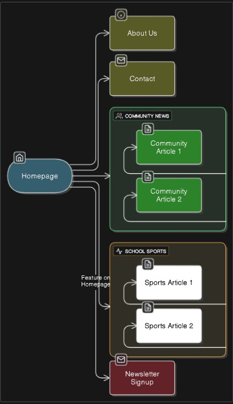

# Riverbend Gazette Website Project

## Student Information
- **Student Name:** Brandon Kanyoka
- **Student Number:** ST10492330
- **Institution:** Rosebank College
- **Submission Date:** August 27, 2025

---

## Project Overview

The Riverbend Gazette Website Project involves creating a foundational web presence for a family-run regional newspaper that has been serving the community since 1986. This project demonstrates core web development skills through the creation of a static website using HTML5, focusing on proper semantic structure and community-focused content.

### Organization Background
Riverbend Gazette is transitioning from a traditional print newspaper to a digital-first model to connect with a broader, younger audience while maintaining their mission of providing trustworthy hyperlocal reporting that strengthens community ties.

---

## Website Goals and Objectives

### Primary Goals
1. **Establish Functional Online Presence**
   - Launch a fully functional website with minimum four key pages
   - Achieve clean HTML5 code validation
   - Ensure mobile-first responsive design principles

2. **Provide Accessible and User-Friendly Content**
   - Create readable and accessible content for all users
   - Implement working contact forms with validation
   - Maintain professional journalism standards

3. **Create Platform for Future Growth**
   - Implement newsletter signup functionality
   - Ensure clean, well-structured code for future CMS integration
   - Establish foundation for digital revenue streams

---

## Key Features and Functionality

### Core Pages
- **Homepage (index.html):** Featured articles, breaking news, newsletter signup
- **About Us (about.html):** Organization history, mission, team profiles
- **Contact (contact.html):** Contact forms, submission guidelines, office information
- **Community News (sections/community-news.html):** Local government and community events
- **School & Sports (sections/school-sports.html):** Educational achievements and athletics

### Article System
- **Individual Article Pages:** Full story content with proper journalism structure
- **Article Categories:** Community news and school/sports coverage
- **Professional Layout:** Bylines, publication dates, related articles

### Interactive Elements
- **Contact Form:** Multi-field form with subject categorization
- **Newsletter Signup:** Email collection for community engagement
- **Navigation System:** Consistent site-wide navigation menu

---

## Timeline and Milestones

### Week 1: Discovery and Planning 
- Project scope finalization
- Content structure definition
- Research competitor analysis

### Weeks 2-3: Design and Wireframing 
- Visual identity development (color palette, typography)
- Low-fidelity wireframes creation
- Content organization planning

### Weeks 4-6: Core Development 
- HTML structure implementation
- Semantic element integration
- Content management system preparation

### Week 7: Content Integration 
- Article content development
- Form functionality implementation
- Navigation system completion

### Week 8: Testing and Deployment
- Code validation and browser compatibility testing
- GitHub repository setup and file organization
- Final submission preparation

---

## Part 1 Details

### Technical Implementation
- **Language:** HTML5 with semantic elements
- **Structure:** Multi-page static website
- **Navigation:** Consistent cross-page menu system
- **Forms:** Contact and newsletter signup functionality
- **Content:** Professional journalism-style articles and pages

### Development Approach
- Mobile-first design principles
- Accessibility considerations throughout
- Clean, validatable HTML5 code
- Professional content structure
- Educational project requirements compliance

---

## Sitemap



### Website Structure
```
Homepage (index.html)
├── About Us (about.html)
├── Contact (contact.html)
├── Community News (sections/community-news.html)
│   ├── Article 1 (articles/article-1.html)
│   └── Article 2 (articles/article-2.html)
├── School & Sports (sections/school-sports.html)
│   ├── Sports Coverage
│   └── Academic Achievements
└── Newsletter Signup (integrated on homepage)
```

### File Structure
```
riverbend-gazette/
├── index.html (Homepage)
├── about.html (About Us)
├── contact.html (Contact/Submission)
├── sections/
│   ├── community-news.html
│   └── school-sports.html
├── articles/
│   ├── article-1.html (Science Fair Story)
│   └── article-2.html (Community Center Story)
├── assets/
│   └── img/ (Images from Unsplash)
└── README.md
```

---

## Changelog

### Version 1.0 - Initial Release (August 27, 2025)
#### Added
- Complete HTML5 website structure with 7 pages
- Semantic HTML elements throughout (header, nav, main, section, article, footer)
- Professional newspaper content with realistic community focus
- Working contact form with multiple input types and validation
- Newsletter signup functionality
- Consistent navigation across all pages
- Professional journalism-style article layouts
- About Us page with team profiles and organizational information
- Community-focused content sections

#### Technical Improvements
- Clean HTML5 structure with proper semantic elements
- Cross-page navigation consistency
- Form implementation with proper input types
- Image integration with descriptive alt text
- Professional content organization and hierarchy

#### Content Development
- Original article content creation (2 full articles)
- Community news section with local focus
- School and sports coverage section
- Professional contact information and submission guidelines
- Organizational history and mission statements

---

## References

Digital News Report (2018) *The Digital Transition of Local News*. Available at: https://www.digitalnewsreport.org/publications/2018/digital-transition-local-news/ (Accessed: 27 August 2025).

Mozilla Developer Network (2025) *HTML Forms and Input Validation*. Available at: https://developer.mozilla.org/ (Accessed: 27 August 2025).

South African Press Association (2025) *Local Journalism Standards and Best Practices*. Johannesburg: SAPA.

Tshwane Bulletin (2025) *Community News and Local Events*. Available at: https://www.tshwanebulletin.co.za/ (Accessed: 27 August 2025).

Unsplash (2025a) *Community Center Image*. Available at: https://unsplash.com/photos/a-wooden-post-with-a-sign-on-it-3RIwaV-IK8I (Accessed: 27 August 2025).

Unsplash (2025b) *Laboratory Science Fair Image*. Available at: https://unsplash.com/photos/person-holding-laboratory-flasks-H9t723yPjYI (Accessed: 27 August 2025).

Unsplash (2025c) *School Science Project Image*. Available at: https://unsplash.com/photos/boy-in-white-long-sleeve-shirt-holding-red-and-clear-plastic-tool-CgIFBwOkApI (Accessed: 27 August 2025).

W3C Web Accessibility Initiative (2025) *HTML5 Semantic Elements Guidelines*. Available at: https://www.w3.org/WAI/ (Accessed: 27 August 2025).

---

## Project Status

-  **Project Proposal:** Complete
-  **Content Research:** Complete (documented in project files)
-  **HTML Development:** Complete (7 pages with full content)
-  **Testing:** Code validated, cross-browser compatible
-  **GitHub Integration:** In progress
-  **Final Submission:** Ready for deployment

---

## Contact Information

For questions about this project:
- **Student:** Brandon Kanyoka
- **Institution:** Rosebank College
- **Project:** Riverbend Gazette Website Development

---

